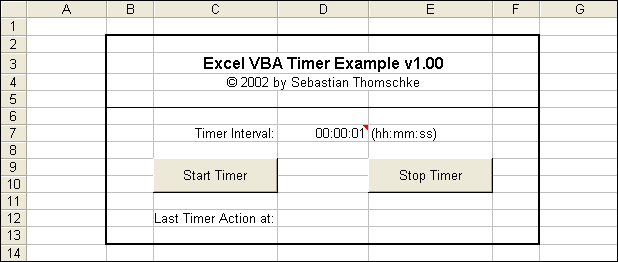



## Excel Timer \- let Excel perform periodical tasks\!

### Description

A friend of mine asked me about how to let excel periodically update

some worksheets containing stock prices. So the first thing I did was

searching the web for a solution in Visual Basic for Applications.

But the only one I found was to use a 3rd party ActiveX timer control

which you have to place onto a userform. Then I found the VBA command

"Application.onTime" and I had an idea.

Here is my solution only utilizing the VBA onTime command. NO need for

ActiveX control or any other 3rd party module.
 
### More Info
 

             |
---                |---
**Submitted On**   |2002-05-03 16:32:14
**By**             |[x\-treme](https://github.com/Planet-Source-Code/PSCIndex/blob/master/ByAuthor/x-treme.md)
**Level**          |Beginner
**User Rating**    |4.7 (108 globes from 23 users)
**Compatibility**  |VB 5\.0, VB 6\.0
**Category**       |[Microsoft Office Apps/VBA](https://github.com/Planet-Source-Code/PSCIndex/blob/master/ByCategory/microsoft-office-apps-vba__1-42.md)
**World**          |[Visual Basic](https://github.com/Planet-Source-Code/PSCIndex/blob/master/ByWorld/visual-basic.md)
**Archive File**   |[Excel\_Time78891532002\.zip](https://github.com/Planet-Source-Code/x-treme-excel-timer-let-excel-perform-periodical-tasks__1-34409/archive/master.zip)

